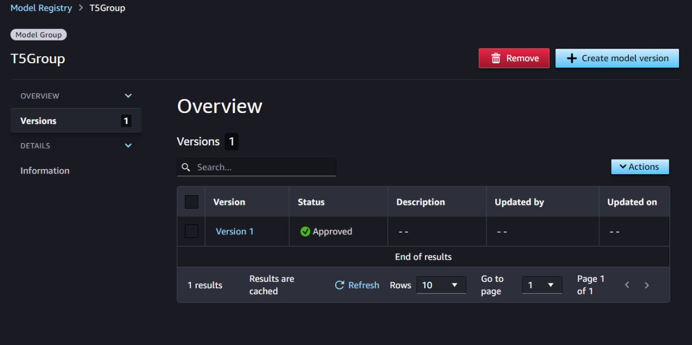

# SageMaker-MLops-Pipeline
 End-End MLops Pipeline - Training of T5 model on Disease Description dataset

In order to run the Pipeline , you need to give amazonsagemaker full access , AmazonSageMakerPipelinesIntegrations and below poicy to be added(which used to give iam access to create lambda role and execute the lambda step)

`{
 "Version": "2012-10-17",
    "Statement": [
        {
            "Effect": "Allow",
            "Action": [
                "lambda:CreateFunction",
                "lambda:DeleteFunction",
                "lambda:InvokeFunction",x
                "lambda:UpdateFunctionCode"
            ],
            "Resource": [
                "arn:aws:lambda:*:*:function:*sagemaker*",
                "arn:aws:lambda:*:*:function:*sageMaker*",
                "arn:aws:lambda:*:*:function:*SageMaker*"
            ]
        },
        {
            "Effect": "Allow",
            "Action": [
                "iam:PassRole"
            ],
            "Resource": "arn:aws:iam::*:role/*",
            "Condition": {
                "StringEquals": {
                    "iam:PassedToService": [
                        "lambda.amazonaws.com"
                    ]
                }
            }
        },
        {
            "Effect": "Allow",
            "Action": [
                "iam:AttachRolePolicy",
                "iam:CreateRole",
                "iam:PutRolePolicy"
            ],
            "Resource": "arn:aws:iam::*:role/*"
        }
    ]
}`

**Workflow Diagram:**

1) T5DemoPreprocessing  : To preprocess the data and store it in the S3 bucket 
2) TrainingT5Model : Training of T5 model and store the model to s3 bucket .
3) EvalStep : write the evaluation report to s3 bucket which is further used for model register.
4) CheckEvalRogue : Its conditional step to check "evaluation rouge1score" if the value is greater than or equal to 0.25  the model will be created and it get register'd in model registry.
5) FailedStep: if "rouge1" score value is less than 0.25 workflow will be halted and workflow status would be changed to failed .
6) T5RegisterModel : Model get registered like below .

7) Deploy-T5-HealthCareModel: Step where the deployment takes place and available for inference.

ModelResponse:

You can do inference in "Test inference in Sagemaker Studio":

